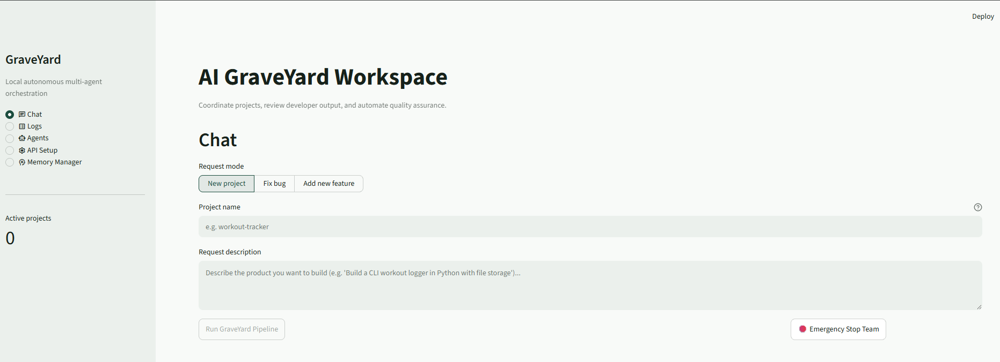

# 🪦 GraveYard
AI Software Engineering Team
Ideas don't die here.
They get built.




**Local-first, autonomous multi-agent software development team.** Describe a product, and a full Scrum team (Prompt Agent → Product Owner → Scrum Master → Developer → QA → Reviewer) breaks it down, writes real code, validates it, and pauses for your approval — all running locally with zero cloud lock-in.

---

## What Is This?

GraveYard is a LangGraph orchestration that turns a natural-language brief into a complete, working codebase. Six specialized agents collaborate through a structured workflow:

| Agent | Role | Key Capability |
|-------|------|----------------|
| **Prompt Agent** | Requirements Analyst | Converts raw input into a structured, unambiguous project brief |
| **Product Owner** | Backlog Owner | Creates prioritized backlog with testable acceptance criteria |
| **Scrum Master** | Workflow Orchestrator | Routes state, enforces sprint discipline, manages human-in-the-loop pauses |
| **Developer** | Senior Engineer | Writes complete, correct, production-grade code — **never placeholders** |
| **QA Engineer** | Test Specialist | Runs automated smoke checks + full verification suites |
| **Reviewer** | Principal Tech Lead | Code review, standards enforcement, merge gatekeeping |

**Validation Gate (Step 25):** Developer output is heuristically scanned for placeholder patterns (print-only bodies, TODOs, mocks, missing library calls) before QA ever sees it. Flagged output triggers automatic regeneration with corrective feedback.

**Human-in-the-Loop:** The graph pauses at `qa_approval` — you review Developer output + QA smoke results in the dashboard, then **Approve** or **Request Rework** with feedback that routes back to the Prompt Agent.

---

## Quick Start

### Prerequisites
- Python 3.10+
- Windows (`.bat` helpers included) or Linux/macOS (bash equivalents below)

### Windows
```bat
first_run.bat     # Creates .venv, installs deps
start_app.bat     # Launches Streamlit dashboard at http://localhost:8501
```

### Linux / macOS
```bash
python -m venv .venv
source .venv/bin/activate
pip install -r requirements.txt
streamlit run webapp/app.py
```

### First Run Checklist
1. Open the dashboard → **API Setup** tab
2. Configure at least one provider connection (OmniRoute, OpenAI, Anthropic, Google, or Local/Ollama)
3. Assign models to each agent role (default: OmniRoute `auto/best-*` aliases)
4. Save configuration
5. Go to **Chat** tab → Create a new project

---

## Architecture at a Glance

```
┌─────────────┐     ┌─────────────┐     ┌─────────────┐     ┌─────────────┐     ┌─────────────┐     ┌─────────────┐
│ Prompt      │────▶│ Product     │────▶│ Scrum       │────▶│ Developer   │────▶│ QA          │────▶│ Reviewer    │
│ Agent       │     │ Owner       │     │ Master      │     │ (validated) │     │ Engineer    │     │             │
└─────────────┘     └─────────────┘     └─────────────┘     └─────────────┘     └─────────────┘     └─────────────┘
       │                   │                   │                   │                   │                   │
       ▼                   ▼                   ▼                   ▼                   ▼                   ▼
  Structured         Backlog +           Workflow            Real code +         Smoke + full       Code review +
  Brief              Acceptance          Routing +           DiffTask            QA results         Approval
  (JSON)             Criteria            Human-in-the-loop                                       decision
                                                                                │
                                                                                ▼
                                                                        ┌─────────────────┐
                                                                        │ HUMAN APPROVAL  │
                                                                        │ (Dashboard UI)  │
                                                                        └─────────────────┘
```

**Storage:**
- `projects/<project_name>/` — Generated source code per project
- `data/checkpoints.db` — LangGraph thread state (enables pause/resume across restarts)
- `data/memory.db` — Long-term cross-project agent memories (code conventions, DoD preferences, QA rules)

---

## Dashboard Tabs

| Tab | Purpose |
|-----|---------|
| **Chat** | Submit briefs, start projects, review human-in-the-loop checkpoints, approve/rework |
| **Logs** | Real-time agent activity, validation-gate events, retries, state transitions |
| **Agents** | View/edit agent role definitions, base prompts, model assignments |
| **API Setup** | Configure provider connections, model-role mappings (persists to `config/config.yaml`) |
| **Memory Manager** | Inspect/delete long-term memories by namespace (e.g., `("developer", "code_patterns")`) |

---

## Project Structure

```
.
├── config/
│   ├── config.yaml            # Your provider credentials & model mappings (gitignored)
│   ├── config.example.yaml    # Template
│   └── settings.py            # Config loader
├── data/
│   ├── checkpoints.db         # LangGraph checkpoint store
│   └── memory.db              # Long-term agent memory base store
├── docs/
│   ├── USER_GUIDE.md          # Operating the dashboard & workflow
│   ├── EXAMPLES.md            # Sample briefs, expected flow, regression commands
│   ├── ARCHITECTURE.md        # Agent roles, state, storage, validation gate
│   ├── TESTING.md             # Unit, prompt-regression, full-suite commands
│   └── PRODUCTION_READINESS.md# Release, operations, safety checklist
├── projects/                  # Generated project outputs (per-project folders)
├── scrum_team/
│   ├── agents/                # Agent prompt templates (canonical, regression-tested)
│   │   └── prompts/
│   ├── graph.py               # LangGraph workflow definition
│   ├── nodes/                 # Node implementations (prompt_agent, po_agent, dev_agent, qa_agent, reviewer_agent)
│   ├── runner.py              # Graph execution + checkpointing
│   ├── state.py               # Typed state schema
│   ├── memory_store.py        # Long-term memory persistence
│   └── utils/                 # Brief/backlog schemas, code search, diff applier, LLM factory
├── tests/
│   └── unit/                  # Prompt templates, validation gate, prompt regression
├── webapp/
│   ├── app.py                 # Streamlit dashboard (5 tabs)
│   └── memory_ui.py           # Memory Manager UI
├── first_run.bat              # Windows: create venv + install deps
├── start_app.bat              # Windows: launch Streamlit
├── run_tests.bat              # Windows: run full test suite
└── requirements.txt
```

---

## Testing & Quality Gates

### Fast Offline Checks (no provider credentials needed)
```bash
# Unit tests only
python -m pytest tests/unit -q
```

### Prompt Regression Gate (run after ANY prompt edit)
```bash
python -m pytest tests/unit/test_prompt_templates.py tests/unit/test_step25_validation_gate.py tests/unit/test_step27_prompt_regression.py -q
```
Validates: Developer output passes Step 25 validator, PO acceptance criteria are specific, QA references actual features, Reviewer names inspected files.

### Full Suite
```bash
python -m pytest tests -q
```
Some E2E tests require OmniRoute service + approved model routes. Failures citing provider auth or unavailable non-OmniRoute models are environment issues, not regressions.

### Windows Helper
```bat
run_tests.bat
```

---

## Configuration

Edit `config/config.yaml` (created on first save from **API Setup** tab):

```yaml
connections:
  omniroute:
    provider: omniroute
    url: "http://localhost:20128/v1"
    api_key: ""
  openai:
    provider: openai
    url: "https://api.openai.com/v1"
    api_key: ""
  # ... anthropic, google, local (Ollama)

model_mapping:
  PO:           {connection: omniroute, model: "auto/best-reasoning"}
  QA:           {connection: omniroute, model: "auto/best-reasoning"}
  DEVELOPER:    {connection: omniroute, model: "auto/best-coding"}
  SCRUM_MASTER: {connection: omniroute, model: "auto/chat"}
  REVIEWER:     {connection: omniroute, model: "auto/chat"}
```

**Model aliases:** OmniRoute `auto/best-*` routes to the current best model per category. Replace with explicit model IDs from your chosen provider if using direct provider connections.

---

## Documentation

| Doc | Covers |
|-----|--------|
| [User Guide](docs/USER_GUIDE.md) | Dashboard operation, project creation, human-in-the-loop, memory management |
| [Examples](docs/EXAMPLES.md) | Sample briefs, expected team flow, prompt-regression commands |
| [Architecture](docs/ARCHITECTURE.md) | Agent roles, state machine, storage, validation gate internals |
| [Testing](docs/TESTING.md) | Test commands, prompt regression gate, live testing policy |
| [Production Readiness](docs/PRODUCTION_READINESS.md) | Pre-release checklist, operational data, security boundaries, known limits |

---

## Why GraveYard?

| Manual Agent Orchestration | GraveYard |
|----------------------------|---------------|
| Copy-paste prompts between tools | Single dashboard, persistent workflow |
| No memory across sessions | Long-term cross-project memory (code conventions, DoD, QA rules) |
| Placeholder code slips through | Heuristic validation gate (Step 25) catches stubs before QA |
| No structured quality gate | QA smoke + full verification + Reviewer gate + **human approval** |
| Context lost on restart | LangGraph checkpoints persist to SQLite — pause/resume anytime |
| Ad-hoc model selection | Centralized model-role mapping per agent |
| Hard to audit agent decisions | Full log trail + agent-specific log filtering |

---

## License

MIT — see [LICENSE](LICENSE).

---

## Contributing

1. Fork → branch → PR
2. Run prompt regression gate before committing prompt changes
3. Run full test suite before PR
4. Keep changes scoped; no unrelated refactoring

**Prompt edits:** The regression gate in `tests/unit/` is the source of truth for output quality. If you change anything in `scrum_team/agents/prompts/`, the gate must pass.

---

*Built with LangGraph, Streamlit, and a bias for local-first, auditable agent workflows.*